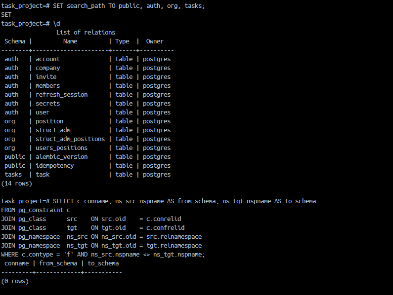

# Содержание
- [Запуск проекта](#запуск-проекта)
- [Переменные окружения](#переменные-окружения)
- [Подразделения](#подразделения)
- [Паттерн -> где в коде](#паттерн---где-в-коде)
- [Что поменять при распиле на микросервисы](#что-поменять-при-распиле-на-микросервисы)
- [Список эндпоинтов](#список-эндпоинтов)
- [Тест запросов через Postman](#тест-запросов-через-postman)


# Запуск проекта
- Клонируйте репозиторий
```shell
git clone https://github.com/sqqqwer/Zadan4FastApi.git
```
- Перейдите в проект
```shell
cd Zadan4FastApi/
```
- Подготовьте .env файл.
- Запустите docker

### Запустить Проект
- Поднимите контейнеры
```shell
make docker-up
```
### Запустить тесты
- Установите виртуальное окружение
```shell
make install
```
- Поднять тестовые контейнеры, линтер, запустить все тетсы
```shell
make prepare
```
- Тесты границ проходит

# Переменные окружения

- POSTGRES_USER - пользователь постгресса
- POSTGRES_PASSWORD - пароль постгресса
- POSTGRES_DB - имя базы данных постгресса
- DB_HOST - названия контейнера базы данных
- DB_PORT - внутрений порт контейнера базы данных 
- FRONTEND_URL - ссылка фронтенда для генерации ссылки с приглашением
- JWT_PRIVATE_KEY_PATH - путь к файлу (в контейнере) приватного ключа RS256 для jwt
- JWT_PUBLIC_KEY_PATH - путь к файлу (в контейнере) публичного ключа RS256 для jwt
- JWT_ALGORITHM - имя алгоритма (RS256)
- JWT_ISSUER - название модуля, подписывающего jwt (auth-module)
- JWT_AUDIENCE - аудитория, кто может проверять jwt (tasks-platform)
- IDEMPOTENCY_HMAC_SECRET - HMAC-SHA256 секретный ключ для  request, который сохраняется в Idempotency

# Подразделения
- Решил что связи Должность-Пользователь, привязаные к Подразделению, это важные данные, поэтому Подразделение нельзя удалить, пока у него есть Должности.
- При переносе ветки под собственного потомка, выкидывает отдельное исключение StructMoveTargetInSubTree (код 409 - конфликт).

# Паттерн -> где в коде
- Репозиторий - в папке ***repositories*** в модулях и core
- Сервис слой - в папке ***services*** в модулях и core
- Uow [Uow-сервис](./src/core/services/uow.py) | [получение сессии](./src/core/dependencies/session.py)
- Dependency Injection - Стандартный Depends в папке ***dependencies*** в модулях и core
- Публичный DTO [auth](./src/modules/auth/public/dto.py) | [org](./src/modules/org/public/dto.py)
| [tasks](./src/modules/tasks/public/dto.py)
- Порты и адаптеры [tasks_port](./src/modules/tasks/ports.py) | [org_port](./src/modules/org/ports.py) | [tasks_adapter](./src/adapters/tasks_local_user_directory.py) | [org_adapter](./src/adapters/org_local_user_directory.py) | [auth_public_service](./src/modules/auth/public/service.py)
- Эвенты - отдлельно в папке [events](./src/core/events/). Создаётся в lifespan в [main](./src/core/main.py)

# Что поменять при распиле на микросервисы
Перекинуть всё что в модулях импортируется из core в модули
(Идемпотентность, абстрактные репозитории, crud сервисы, зависимтости, систему эвентов, логирование, обработку исключений, базовые схемы, uow, получение сессии, jwt-decoder, token_claims_sheme, зависимости аунтефикации)

Убрать зависимости адаптеров и переписать их.

# Список эндпоинтов

http://localhost:8000/docs

# Тест запросов через Postman
- Импортируйте файл [tasks-platform.postman_collection](./postman/tasks-platform.postman_collection.json) в Postman
